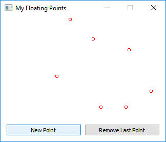

# "Floating Points" - Taskdescription

## Einführung
Das Beispiel zeigt die Verwendung von Qt5 in Verbindung mit Shared-Memory zur nebenläufigen Programmierung.
Dabei ist auf die getrennte Implementierung der View und des Controllers zu achten.

## Ziele
Mit der Umsetzung des Beispiels soll das Verständnis für Shared memory geschult werden.

## Voraussetzungen
* Grundverständnis von Python
* Lesen und Umsetzen von APIs
* Automatisiertes Testen mittels Unit- und System-Tests

## Detailierte Ausgabenbeschreibung
Erstelle ein einfaches GUI-Programm auf Basis der folgenden Abbildung unter Anwendung des MVC Design Patterns!

**Grundanforderungen**
Die grafische Oberfläche soll mittels Designer erstellt werden. Dabei muss auf eine klare Trennung von View und Controller geachtet werden.
Als Einstieg soll die GUI eine fixe Größe (kein Resize) und zwei Buttons besitzen: "New Point" und "Remove Last Point".

Bei einem Klick auf "New Point" wird ein neuer Prozess erstellt und eine zufällige Geschwindigkeit und Startposition festgelegt.
Dieser Prozess ändert in einem geteilten Speicher seine x- und y-Position in regelmäßigen Abständen (z.B. 20-mal in der Sekunde) basierend auf seiner Geschwindigkeit.
Der Kreis "prallt" an den Kanten des Fensters ab und ändert seine Richtung, bevor er sich aus dem Fenster bewegen würde.

Bei einem Klick auf "Remove Last Point" wird der letzte Prozess sauber beendet und der Kreis verschwindet von der GUI.
Der Main-Prozess zeichnet die Prozesse als Kreise und behandelt die Events.
Wenn das Programm geschlossen wird, werden alle Prozesse sauber geschlossen.

**Erweiterungen**
Die Kreise sollen nun in unterschiedlichen Größen und Farben initialisiert werden.
Dies soll über eine Texteingabe für die Größe und ein Auswahlfeld für die Farben realisiert werden.
Das Fenster soll nun größenverstellbar sein und die Kreise müssen entsprechend auf die veränderte Größe reagieren.
Bei einer Bereichsüberschreitung muss die Position angepasst werden.

## Bewertung
Gruppengrösse: 1 Person
### Grundanforderungen *überwiegend erfüllt*
+ Grafische Oberfläche in Qt5
    * fixe Fenstergröße
+ Explizite Trennung der View- und Controller-Implementierung
+ Hinzufügen von neuen Kreisen
    * Position in einem geteilten Speicher
    * zufällige Geschwindigkeit
+ Schließen aller Prozesse und Freigabe der Resourcen
+ Sphinx-Dokumentation

### Grundanforderungen *zur Gänze erfüllt*
+ Entfernung des letzten Kreises durch Betätigung des Buttons "Remove Last Point"

### Erweiterte Anforderungen *überwiegend erfüllt*
+ Kreise können mit unterschiedlichen Farben und Größen initialisiert werden
    * Die Größe ist auf minimal 3 und maximal 50 Pixel zu beschränken
    * Die Farbauswahl soll nur Rot, Grün, Blau und Schwarz erlauben

### Erweiterte Anforderungen *zur Gänze erfüllt*
+ Das Fenster ist in der Größe anpassbar
+ Die Kreise reagieren auf die Anpassung der Größe entsprechend

## Umgebung und Tests
Das Beispiel soll entsprechend der Anforderungsbeschreibung implementiert werden.
Im Laufe der Implementierung wird es die Möglichkeit geben, die Funktionalität auf definierte Testfälle hin zu überprüfen und gegebenermaßen anzupassen.

Folgende Befehle werden bei der Abnahme ausgeführt und bewertet:

    tox

## Quellen
[PyQt5 Reference Guide](http://pyqt.sourceforge.net/Docs/PyQt5)
[Python-Documentation: Shared Memory mit multiprocessing.Array](https://docs.python.org/3/library/multiprocessing.html?multiprocessing.Array#multiprocessing.Array)